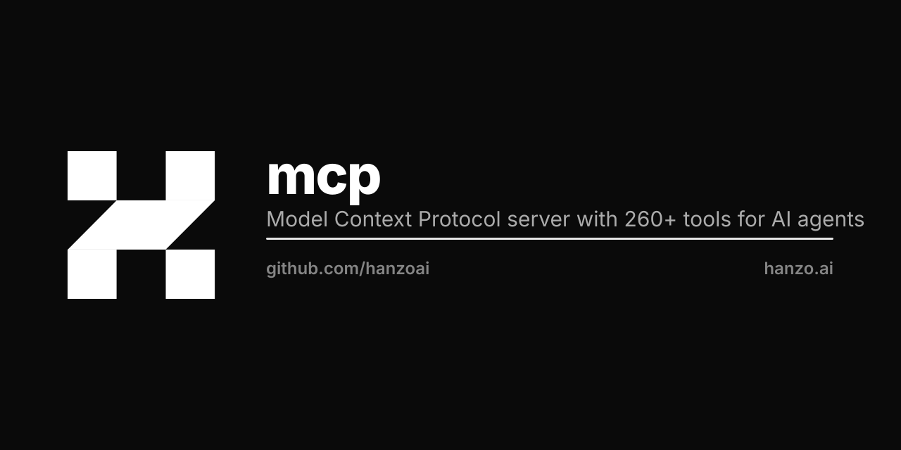

<p align="center"></p>

# @hanzo/mcp

The canonical Model Context Protocol server for the Hanzo AI Cloud — one action-routed tool surface every Hanzo agent runs on.

[](https://www.npmjs.com/package/@hanzo/mcp)
[](https://pypi.org/project/hanzo-mcp/)
[]()
[]()

## Quick start

```bash
npm install -g @hanzo/mcp
hanzo-mcp serve
```

## What this is

`@hanzo/mcp` is the canonical MCP server for the Hanzo platform. It collapses a 260+ tool catalog into **13 HIP-0300 action-routed tools** (`fs`, `exec`, `code`, `git`, `fetch`, `workspace`, `ui`, plus optional `think`, `memory`, `hanzo`, `plan`, `tasks`, `mode`) served over the MCP stdio / streamable-http transports.

Every Hanzo agent speaks this same tool surface. The Python SDK (`hanzo-mcp` on PyPI) and the Rust crate (`hanzo-mcp::brain`) mirror it 1-to-1, so a tool name and its action schema are identical across all three runtimes.

Implements:
- **HIP-0300** — Unified MCP Tools
- **HIP-0106** — Unified Cloud Binary (`mcp` subsystem)

## Tool surface (HIP-0300)

13 canonical tools organized by axis. Each tool uses action-routed dispatch — one tool name, many verbs.

### Core tools (7)

| Tool | Axis | Key actions |
|------|------|-------------|
| `fs` | Bytes + paths | read, write, stat, list, mkdir, rm, mv, apply_patch, search_text |
| `exec` | Execution | run, background, ps, kill, logs |
| `code` | Symbols + semantics | parse, search, transform, summarize |
| `git` | Diffs + history | status, diff, log, commit, branch, stash |
| `fetch` | HTTP | get, post, put, delete, download |
| `workspace` | Project context | info, config, env, dependencies |
| `ui` | UI components | list_components, fetch_component, search, install |

### Optional tools (6)

| Tool | Purpose |
|------|---------|
| `think` | Structured reasoning |
| `memory` | Persistent storage |
| `hanzo` | Hanzo platform surface (iam, kms, paas, commerce) |
| `plan` | Task planning |
| `tasks` | Task tracking |
| `mode` | Developer modes |

### Community tools (opt-in)

Third-party descriptors that shell out to externally-installed binaries. Off by default; enable individually.

| Tool | Source | Purpose |
|------|--------|---------|
| `tesseract.deploy` | [kcolbchain/tesseract](https://github.com/kcolbchain/tesseract) | Deploy zk-OCR relayer to a target chain |
| `tesseract.health_check` | [kcolbchain/tesseract](https://github.com/kcolbchain/tesseract) | Probe deployed relayer addresses |
| `tesseract.monitor` | [kcolbchain/tesseract](https://github.com/kcolbchain/tesseract) | Poll matching contract events |
| `compress.solana` | [kcolbchain/blockchain-compression](https://github.com/kcolbchain/blockchain-compression) | Compress blob with Solana-tuned compressor |

Enable with `hanzo-mcp serve --enable-community-cryptuon`. See `src/tools/community/cryptuon/` for descriptors and per-tool env overrides (e.g. `$CRYPTUON_TESSERACT_DEPLOY`).

## Usage

### CLI

```bash
# Default: HIP-0300 unified surface (13 tools)
hanzo-mcp serve

# Legacy individual tools (read_file, write_file, bash, …)
hanzo-mcp serve --legacy

# UI extensions
hanzo-mcp serve --enable-ui --enable-desktop

# Disable specific tools
hanzo-mcp serve --disable-tools plan,tasks

# List available tools
hanzo-mcp list-tools

# Install for Claude Desktop
hanzo-mcp install-desktop
```

### Programmatic

```typescript
import { getConfiguredTools } from '@hanzo/mcp';

// HIP-0300 unified surface (default)
const tools = getConfiguredTools({ unified: true });

// Legacy individual tools
const legacy = getConfiguredTools({ enableLegacy: true });

// With UI extensions
const withUI = getConfiguredTools({
  unified: true,
  enableUI: true,
  enableDesktop: true,
});
```

## Client configuration

### Claude Desktop / Cursor / Code

Add to `.mcp.json`:

```json
{
  "mcpServers": {
    "hanzo": {
      "command": "npx",
      "args": ["-y", "--package=@hanzo/mcp", "hanzo-mcp", "serve"]
    }
  }
}
```

> **Why `--package=`?** Without it, `npx -y @hanzo/mcp serve` resolves `serve` as a *separate* npm package (the unrelated static-file server) and runs that instead of `hanzo-mcp`. The `--package=` form binds npx to the right binary. This matters on every platform — Windows, macOS, and Linux.

## Troubleshooting

If MCP "doesn't work" in Claude Desktop, Claude Code, Cursor, or any other client:

1. **Verify the stdio handshake from the command line:**
   ```bash
   echo '{"jsonrpc":"2.0","id":1,"method":"initialize","params":{"protocolVersion":"2025-06-18","capabilities":{},"clientInfo":{"name":"t","version":"1"}}}' \
     | npx -y --package=@hanzo/mcp@latest hanzo-mcp serve
   ```
   A working install prints a JSON-RPC response with `"serverInfo":{"name":"hanzo-mcp","version":"…"}` within ~10 s. Silence (or a long hang) means the wrong binary is running.

2. **Turn on debug logging** by setting `HANZO_MCP_DEBUG=1` in the client's MCP server env block. Stderr will then include the resolved CLI path, cwd, argv, and PATH prefix — usually enough to tell whether a stray `serve` binary, a wrong `npx` arg form, or a port conflict is shadowing the server.

   ```json
   "hanzo": {
     "command": "npx",
     "args": ["-y", "--package=@hanzo/mcp", "hanzo-mcp", "serve"],
     "env": { "HANZO_MCP_DEBUG": "1" }
   }
   ```

   In Claude Desktop the stderr lands in `~/Library/Logs/Claude/mcp-server-hanzo.log` (macOS) or `%APPDATA%\Claude\logs\mcp-server-hanzo.log` (Windows).

3. **Rerun the installer** to overwrite a stale (2.4.1 or earlier) config:
   ```bash
   npx -y --package=@hanzo/mcp@latest hanzo-mcp install --claude-desktop
   ```
   Then restart Claude Desktop.

4. **Windows specifics.** `npx.cmd` shells out to `cmd.exe` for arg parsing, which is sensitive to quoting. If the JSON config uses single quotes anywhere, switch to double quotes.

5. **CI invariants.** The protocol-level contract is exercised on every push to main, on native Linux amd64 + arm64 (Hanzo self-hosted runners, no QEMU), via `scripts/smoke-mcp.mjs` and an e2e test against the *published* npm package using the same npx invocation shipped to clients. If MCP works locally but fails for you, open an issue with the `HANZO_MCP_DEBUG=1` log attached.

## Architecture

```
   Claude Desktop / Cursor / Code  ->  stdio MCP transport
                                              |
                                          hanzo-mcp serve
                                              |
                          +-------------------+-------------------+
                          |                                       |
                  HIP-0300 unified tools          legacy individual tools (--legacy)
                  fs / exec / code / git /         read_file, write_file, bash, …
                  fetch / workspace / ui +
                  optional think / memory /
                  hanzo / plan / tasks / mode
                          |
                  TS runtime (today) | Rust runtime (latency-sensitive)
                          |
                  Go runtime under hanzoai/cloud (HIP-0106 in flight)
```

Source layout:

```
src/tools/unified/    # HIP-0300 action-routed tools (fs, exec, code, fetch, workspace, hanzo)
src/tools/            # Individual tools (git, think, memory, tasks, plan, mode, …)
rust/src/tools/       # Rust native tools (exec, git, fetch, code, computer, …)
```

The Rust runtime provides native performance for latency-sensitive operations (<5 ms clicks, <2 ms keypress, <50 ms screenshots).

## Python SDK parity

The Python implementation (`hanzo-mcp` on PyPI) exposes the same 13 HIP-0300 tools via entry-point discovery from `hanzo-tools-*` packages. Tool names and action schemas are identical across both runtimes.

```bash
pip install hanzo-mcp
```

## License

MIT

## Hanzo — the Open AI Cloud

Open source · every language · on-chain settlement. [hanzo.ai](https://hanzo.ai) · [docs.hanzo.ai](https://docs.hanzo.ai)

**SDKs in every language** — [Python](https://github.com/hanzoai/python-sdk) (flagship) · [TypeScript](https://github.com/hanzo-js/sdk) · [Go](https://github.com/hanzo-go/sdk) · [Rust](https://github.com/hanzo-rs/sdk) · [C++](https://github.com/hanzo-cpp/sdk) · [Swift](https://github.com/hanzo-swift/sdk) · [Kotlin](https://github.com/hanzo-kt/sdk) · [umbrella](https://github.com/hanzoai/sdk)
